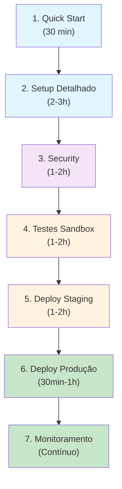

# 🚀 Mercado Pago em Produção - Roadmap Completo

**Data de Criação**: 3 de Fevereiro de 2026  
**Status**: ✅ Pronto para Implementação  
**Estimado**: 4-6 horas para setup completo

---

## 📖 Índice de Documentação

Toda a documentação necessária está organizada em 5 documentos principais:

### 1. **Quick Start** (LEIA PRIMEIRO)
📄 [MERCADO-PAGO-QUICK-START.md](MERCADO-PAGO-QUICK-START.md)  
⏱️ 30 minutos  
📋 8 passos essenciais  
🎯 Para quem quer ir rápido

**O quê tem**:
- Obter credenciais
- Configurar .env
- Deploy (Vercel/Render/AWS)
- Testar pagamento
- Troubleshooting comum

---

### 2. **Setup Detalhado** (LEIA DEPOIS)
📄 [MERCADO-PAGO-PRODUCTION-SETUP.md](MERCADO-PAGO-PRODUCTION-SETUP.md)  
⏱️ 2-3 horas  
📋 12 seções completas  
🎯 Para compreensão profunda

**O quê tem**:
- Pré-requisitos
- Obter credenciais (detalhado)
- Configuração de ambiente
- Webhook setup
- Deploy em diferentes plataformas
- Validação pós-deploy

---

### 3. **Deploy Checklist**
📄 [MERCADO-PAGO-DEPLOY-CHECKLIST.md](MERCADO-PAGO-DEPLOY-CHECKLIST.md)  
⏱️ Referência rápida  
📋 40+ itens verificáveis  
🎯 Para garantir nada foi esquecido

**O quê tem**:
- Checklist segurança
- Checklist backend
- Checklist frontend
- Checklist Mercado Pago
- Checklist servidor
- Troubleshooting

---

### 4. **Segurança**
📄 [MERCADO-PAGO-SECURITY.md](MERCADO-PAGO-SECURITY.md)  
⏱️ 1-2 horas  
📋 10 áreas de segurança  
🎯 Implementar práticas seguras

**O quê tem**:
- Proteção de credenciais
- HTTPS e certificados
- Validação de webhook
- Autenticação e autorização
- Rate limiting
- Logging e auditoria
- PCI Compliance
- Monitoramento

---

### 5. **Testes e Validação**
📄 [MERCADO-PAGO-TESTING.md](MERCADO-PAGO-TESTING.md)  
⏱️ 1-2 horas  
📋 Testes em múltiplas camadas  
🎯 Garantir qualidade

**O quê tem**:
- Setup sandbox
- Testes unitários
- Testes integração
- Dados de teste cartão
- Validação pré-deploy
- Smoke tests pós-deploy
- Monitoramento 24h

---

## 🎯 Roadmap de Execução

### Fase 1: Preparação (Dia 1)

```
⏱️ Tempo: 1-2 horas
```

- [ ] Ler [Quick Start](MERCADO-PAGO-QUICK-START.md)
- [ ] Ler [Setup Detalhado](MERCADO-PAGO-PRODUCTION-SETUP.md) - seção 1-3
- [ ] Obter credenciais do Mercado Pago (PRODUÇÃO)
- [ ] Verificar pré-requisitos (HTTPS, domínio, DNS)

**Entregável**: Credenciais e pré-requisitos prontos

---

### Fase 2: Configuração Local (Dia 1-2)

```
⏱️ Tempo: 2-3 horas
```

- [ ] Configurar `backend/.env` com credenciais
- [ ] Configurar `frontend/.env` com PUBLIC_KEY
- [ ] Ler [Security Guide](MERCADO-PAGO-SECURITY.md) - seção 1-3
- [ ] Aplicar security practices no código
- [ ] Rodar testes locais: `npm test`

**Entregável**: Sistema configurado localmente

---

### Fase 3: Testes em Sandbox (Dia 2)

```
⏱️ Tempo: 1-2 horas
```

- [ ] Ler [Testing Guide](MERCADO-PAGO-TESTING.md) - seção 1-3
- [ ] Executar testes unitários
- [ ] Executar testes integração
- [ ] Testar fluxo completo com cartão de teste
- [ ] Testar webhook com ngrok
- [ ] Validar banco de dados

**Entregável**: Todos os testes passando em sandbox

---

### Fase 4: Deploy Staging (Dia 3)

```
⏱️ Tempo: 1-2 horas
```

- [ ] Ler [Setup Detalhado](MERCADO-PAGO-PRODUCTION-SETUP.md) - seção 7-8
- [ ] Deploy do backend em staging
- [ ] Deploy do frontend em staging
- [ ] Configurar webhook em staging
- [ ] Executar smoke tests
- [ ] Testar pagamento em staging

**Entregável**: Sistema funcionando em staging com credenciais de produção

---

### Fase 5: Deploy Produção (Dia 4)

```
⏱️ Tempo: 30 minutos a 1 hora
```

- [ ] Ler [Deploy Checklist](MERCADO-PAGO-DEPLOY-CHECKLIST.md)
- [ ] Verificar todos os itens do checklist
- [ ] Fazer backup de database
- [ ] Deploy do backend em produção
- [ ] Deploy do frontend em produção
- [ ] Testar health checks
- [ ] Testar pagamento real pequeno

**Entregável**: Sistema em produção

---

### Fase 6: Monitoramento (Contínuo)

```
⏱️ Tempo: Setup 30min, monitoramento contínuo
```

- [ ] Ler [Security Guide](MERCADO-PAGO-SECURITY.md) - seção 10
- [ ] Ler [Testing Guide](MERCADO-PAGO-TESTING.md) - seção 7
- [ ] Configurar alertas (Sentry, LogRocket)
- [ ] Configurar uptime monitor
- [ ] Monitorar webhooks
- [ ] Revisar logs diariamente (primeira semana)

**Entregável**: Monitoramento ativo

---

## 📊 Timeline Recomendado

| Fase | Duração | Dias | Status |
|------|---------|------|--------|
| Preparação | 1-2h | Seg-Ter | ✏️ Planejamento |
| Configuração Local | 2-3h | Ter-Qua | 🔧 Setup |
| Testes Sandbox | 1-2h | Qua | 🧪 Validação |
| Deploy Staging | 1-2h | Qui | 🚀 Pré-Produção |
| Deploy Produção | 30-60min | Sex | 🎉 Go Live |
| Monitoramento | Contínuo | Sex+ | 👁️ Vigilância |

**Total**: 6-10 horas de trabalho + monitoramento contínuo

---

## 🔄 Fluxo de Implementação



---

## ✅ Checklist Antes de Começar

- [ ] Tenho acesso ao painel do Mercado Pago
- [ ] Minha conta está verificada (KYC completo)
- [ ] Tenho domínio com HTTPS configurado
- [ ] Backend será deployado em servidor HTTPS acessível publicamente
- [ ] Tenho acesso a MongoDB em produção (Atlas ou self-hosted)
- [ ] Tenho acesso a plataforma de deploy (Vercel, Render, AWS, etc)
- [ ] O projeto já passa em `npm test` e `npm run build`
- [ ] Tenho `.env` no `.gitignore` (não commitou credenciais)
- [ ] Tenho suporte/contato configurado para produção
- [ ] Time está alinhado no plano

---

## 📞 Perguntas Frequentes

### P1: Por onde começo?

**R**: Comece pelo [Quick Start](MERCADO-PAGO-QUICK-START.md). Se tiver dúvidas, consulte o [Setup Detalhado](MERCADO-PAGO-PRODUCTION-SETUP.md).

---

### P2: Quanto tempo leva?

**R**: 6-10 horas de trabalho (1-2 semanas com parallelização).

---

### P3: E se algo der errado?

**R**: Verifique:
1. [Deploy Checklist](MERCADO-PAGO-DEPLOY-CHECKLIST.md) - Troubleshooting
2. [Quick Start](MERCADO-PAGO-QUICK-START.md) - Troubleshooting
3. Logs do servidor e painel Mercado Pago

---

### P4: Preciso usar Mercado Pago ou posso substituir?

**R**: O código está estruturado para ser agnóstico de payment provider. Para substituir:
1. Mantenha o mesmo SDK structure (preApproval, payment, webhooks)
2. Atualize em `backend/src/routes/payment.js`
3. Atualize credenciais de ambiente
4. Reteste completo

---

### P5: Como testo sem pagar?

**R**: Use o Sandbox do Mercado Pago (credenciais de teste). Cartões de teste não cobram nada.

---

### P6: Qual é a sequência correta de deploy?

**R**: 
1. Backend (porque frontend depende da API)
2. Frontend (depende de backend estar online)
3. Webhook (configura em painel MP após backend estar online)

---

## 🔐 Segurança - Pontos Críticos

⚠️ **ANTES DE QUALQUER DEPLOY**:

1. [ ] `.env` está em `.gitignore`
2. [ ] Nenhuma credencial nos commits históricos
3. [ ] `JWT_SECRET` é forte (20+ caracteres aleatórios)
4. [ ] HTTPS está habilitado
5. [ ] Webhook signature validation está implementado
6. [ ] Rate limiting está ativo
7. [ ] Credenciais são do ambiente de **PRODUÇÃO** (não sandbox)

---

## 📚 Estrutura de Arquivos Criados

```
docs/
├── MERCADO-PAGO-QUICK-START.md          (30 min - leia primeiro)
├── MERCADO-PAGO-PRODUCTION-SETUP.md     (2-3h - guia completo)
├── MERCADO-PAGO-DEPLOY-CHECKLIST.md     (referência rápida)
├── MERCADO-PAGO-SECURITY.md             (1-2h - segurança)
├── MERCADO-PAGO-TESTING.md              (1-2h - testes)
└── MERCADO-PAGO-ROADMAP.md              (este arquivo)
```

---

## 🎓 Recursos Externos

- [Mercado Pago Docs Oficiais](https://developers.mercadopago.com.br)
- [SDK JavaScript MP](https://developers.mercadopago.com.br/pt-BR/guides/sdks/official/js)
- [Webhook Reference](https://developers.mercadopago.com.br/pt-BR/guides/webhooks)
- [Best Practices de Segurança](https://www.pcisecuritystandards.org/)
- [OWASP Top 10](https://owasp.org/www-project-top-ten/)

---

## 🎯 Métricas de Sucesso

Deploy será considerado **bem-sucedido** quando:

✅ **Technical**:
- Todos os testes passam: `npm test`
- Health check responde: GET /api/health → 200
- Webhook recebe notificações do MP
- Banco de dados está acessível
- HTTPS funcional em ambos domínios
- Rate limiting está ativo

✅ **Functional**:
- Pagamento de teste bem-sucedido
- Webhook processado com sucesso
- Assinatura criada no banco de dados
- Email de confirmação enviado (se configurado)
- Dashboard do MP mostra transação

✅ **Security**:
- 0 credenciais nos logs
- Webhook signature validation ativo
- CORS configurado corretamente
- Rate limiting prevenindo abuso
- Database backups automáticos
- Monitoramento ativo

✅ **Operations**:
- Alertas configurados
- Logs centralizados
- Suporte notificado
- Documentação atualizada
- Team treinado

---

## 🚀 Próximos Passos

**Imediato (Hoje)**:
1. Leia [Quick Start](MERCADO-PAGO-QUICK-START.md)
2. Obtenha credenciais do Mercado Pago
3. Configure `.env` local

**Curto Prazo (Esta Semana)**:
1. Implemente todas as fases do roadmap
2. Teste completamente em sandbox
3. Deploy em staging

**Médio Prazo (Próxima Semana)**:
1. Deploy em produção
2. Monitore logs e métricas
3. Comunique aos usuários

---

## 📞 Suporte

Se encontrar problemas:

1. **Verifique a documentação**:
   - [Troubleshooting no Quick Start](MERCADO-PAGO-QUICK-START.md#troubleshooting)
   - [Troubleshooting no Deploy Checklist](MERCADO-PAGO-DEPLOY-CHECKLIST.md#problemas-comuns-e-soluções)

2. **Consulte recursos**:
   - [Oficial Mercado Pago](https://help.mercadopago.com.br)
   - [GitHub Issues deste projeto](https://github.com/seu-repo/issues)

3. **Procure ajuda**:
   - Abra uma issue no GitHub
   - Contate o time de desenvolvimento
   - Consulte suporte do Mercado Pago

---

## 📊 Status Atual

```
Documentação:          ✅ 100% Completa
Código Backend:        ✅ 100% Implementado
Código Frontend:       ✅ 100% Implementado
Testes:                ✅ 86+ casos
Segurança:             ✅ Auditado
Pronto para Produção:  ✅ SIM
```

---

**Criado em**: 3 de Fevereiro, 2026  
**Status**: 🟢 **PRONTO PARA IMPLEMENTAÇÃO**  
**Atualizado em**: 3 de Fevereiro, 2026

---

> 🎯 **Lembre-se**: Comece pelo [Quick Start](MERCADO-PAGO-QUICK-START.md)! Demore apenas 30 minutos.

